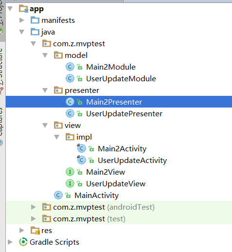

这是一个Android Studio的MVP模版。
目录机构:

```
com.company.app
    +-- model
    |   - MainModule
    +-- presenter
    |   - MainPresenter
    +-- view
    |   +-- impl
    |       - MainActivity
    |   - MainView
    | - YourApp
```
安装(玛德，都是拷贝)
Mac:
把MVPFragment, MVPActivity 和 MVPBoilerplate三个目录拷贝到$ANDROID_STUDIO_FOLDER$/Contents/plugins/android/lib/templates/activities/里面。

Windows:
把MVPFragment, MVPActivity 和 MVPBoilerplate三个目录拷贝到$ANDROID_STUDIO_FOLDER$\plugins\android\lib\templates\activities\里面。（擦，这不是跟上面一模一样的吗）

1. 目录结构

2. 生成基础模版
首先，在包的根目录使用MVP Boilerplate创建基本的结构。这个操作对一个项目只需执行一次：

